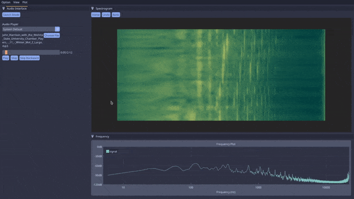

# Spectrolysis
### Real Time 3D Spectrogram and Spectrum Analysis 

For visualizing real time audio spectrogram, supports microphone input and
audio playback.


## Features

- GPU based real-time 3D spectrogram rendering with OpenGL
- Complementary frequency plot with selectable log or linear scale x-axis
- Built in microphone recoder and audio player
- MP3, FLAC, and WAV support
- 3D spectrogram with user controllable rotation, panning, and zoom
- Convolution based smoothing for smoother animation
- Uniform spectrogram colormap with OKLAB colorspace

## Building from Source
### Required Packages
Most external dependencies are included in the `./external` directory, the only 
packages required from the user are:
- SDL2
- OpenGL 3.0 ES (or similar)
- CMake

### Linux
After cloning the repository, navigate to the project directory and run the
following commands in the terminal:
```
$ cd build
$ cmake ..
$ make
```
To run the program (from project directory):
```
$ cd build
$ ./main
```


## Dependencies
This project is made with the following:
- SDL2
- CMake
- OpenGL 3.0 ES (glad)
- OpenGL Mathematics (GLM)
- ImGui/ImPlot
- Pretty Fast Fast Fourier Transfrom (PFFFT)
- tinyfiledialogs 
- dr_libs
- Catppuccin (UI theme)
